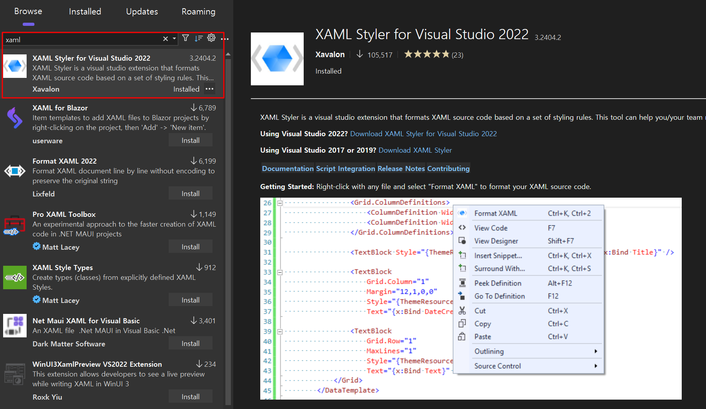
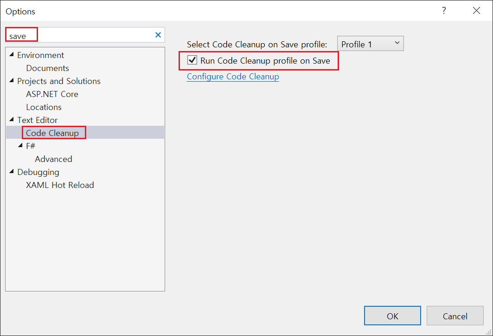
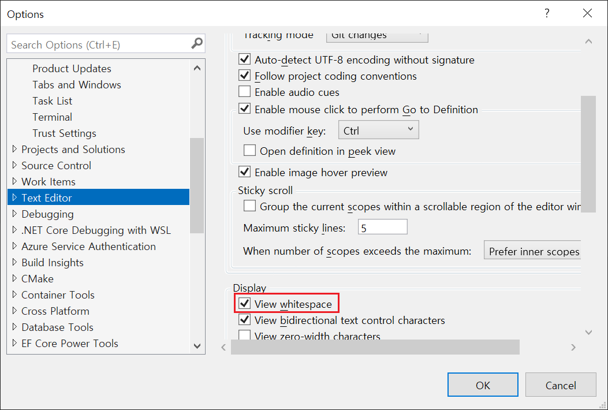

# WPF Samples

WPF에서 자주 사용하는 코드 및 예제를 정리한 저장소입니다.

## Code Format

코드의 포맷을 지정하면 통일성 있고 가독성 있게 코드를 볼 수 있습니다. 아래와 같이 설정할 수 있습니다.

1. xaml 파일

  먼저 XAML의 경우, 아래와 같이 라이브러리를 설치해줍니다.

  

2. .cs 파일

  일반적으로 Ctrl + K, Ctrl + D를 하면 정렬을 할 수 있습니다.
  그러나 이렇게 하면 작업 중 몇몇 코드 정렬이 누락될 수 있습니다.
  VS Code는 format on save 기능을 사용하여 저장할 때마다 코드를 자동으로 정렬할 수 있습니다.

  

3. view whitespace
 
  마지막으로, 작업을 하다 보면 탭과 스페이스를 혼용하여 사용하는 경우가 발생할 수 있습니다.
  이런 경우 아래와 같이 설정하여 확인할 수 있습니다.

  
